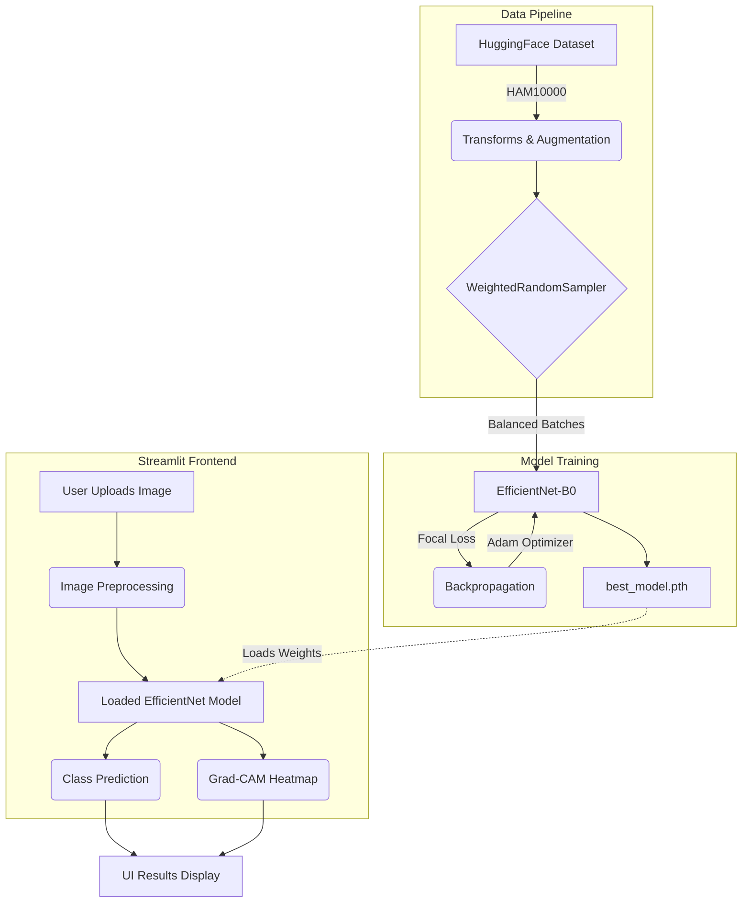

# Skin Lesion Classifier

This project is an end-to-end computer vision application designed to classify skin lesions from dermoscopy images into one of 7 diagnostic categories, utilizing the renowned HAM10000 dataset standards. The application features a PyTorch-based deep learning backend and a visually rich, interactive Streamlit frontend that provides model explainability using Grad-CAM.

---

## 🏗 Architecture Overview

The system is split into two primary components: Model Training Pipeline and Inference Frontend.



### 1. Model Architecture & Training (`train.py`)
- **Core Model**: The project uses **EfficientNet-B0**, leveraging transfer learning with pretrained ImageNet weights. The final classifier head is modified to output 7 classes.
- **Data Pipeline**: The dataset is fetched using the Hugging Face `datasets` library (`marmal88/skin_cancer`). The images are resized to 224x224 and augmented (random horizontal/vertical flips, rotation, and color jitter) to improve generalization.
- **Handling Imbalance**: The HAM10000 dataset is highly imbalanced (e.g., Melanocytic nevi heavily outnumber other classes). To counter this, the training pipeline utilizes:
  - **WeightedRandomSampler**: Ensures each batch has a balanced representation of classes by oversampling minority classes.
  - **Focal Loss**: Focuses the training on hard-to-classify examples and down-weights well-classified examples, providing a robust gradient for minority classes.
- **Optimization**: Adam optimizer with a learning rate of $1\times 10^{-4}$. Checkpointing saves the model that achieves the highest balanced validation accuracy.

### 2. Interactive Frontend App (`app.py`)
- **UI/UX**: Built using **Streamlit** enriched with custom CSS for a premium, dark-mode, glassmorphism aesthetic. 
- **Inference**: Loads the saved `best_model.pth`. Upon uploading an image, the backend runs it through standard ImageNet preprocessing and performs inference.
- **Explainability (XAI)**: To make the model's decisions transparent, the app uses **Grad-CAM (Gradient-weighted Class Activation Mapping)**. It generates a heatmap overlay on the original image, highlighting the visual regions that most heavily influenced the model's prediction.

### 3. Model Evaluation (`compare_models.py` & `dummy_model.py`)
- The repository includes scripts to benchmark parameter counts across different lightweight architectures (ResNet-50, MobileNetV3, EfficientNet-B0).
- A utility script is provided to generate an untrained dummy model, ensuring the UI can be tested without waiting for a full training loop to complete.

---

## 🦠 Supported Categories (HAM10000)
1. Actinic keratoses and intraepithelial carcinoma / Bowen's disease (`akiec`)
2. Basal cell carcinoma (`bcc`)
3. Benign keratosis-like lesions (`bkl`)
4. Dermatofibroma (`df`)
5. Melanoma (`mel`)
6. Melanocytic nevi (`nv`)
7. Vascular lesions (`vasc`)

---

## 🚀 Getting Started

### Prerequisites
Make sure you have Python installed. Install all dependencies using:
```bash
pip install -r requirements.txt
```

### 1. Train the Model
You can start training the model from scratch. The script will automatically download the dataset from Hugging Face and save the best weights to `model_weights/best_model.pth`.
```bash
python train.py
```
*(Alternatively, you can run `python dummy_model.py` to create dummy weights and immediately test the UI).*

### 2. Run the Application
Launch the Streamlit interface:
```bash
streamlit run app.py
```
Open the provided local URL in your browser, upload a dermoscopy image, and view the predictions alongside the Grad-CAM heatmap.
